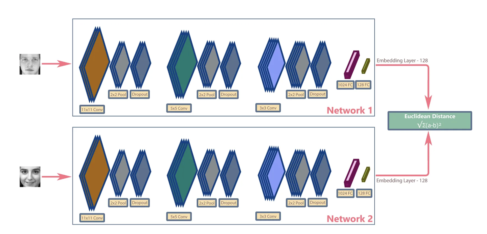
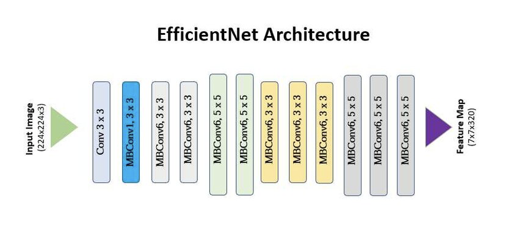
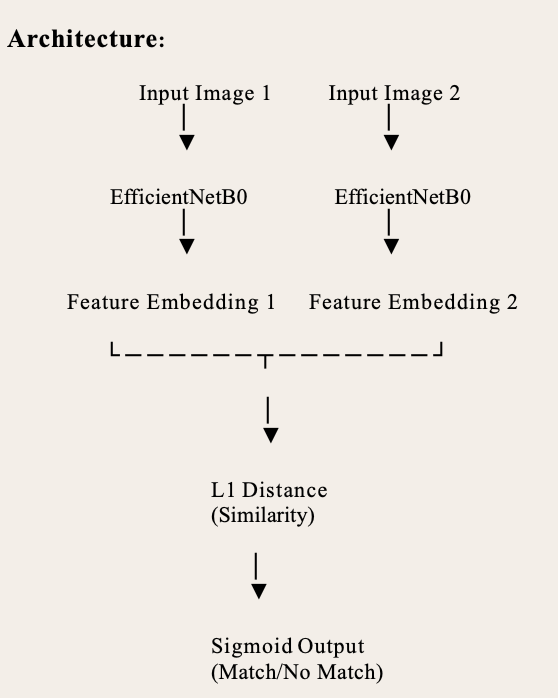
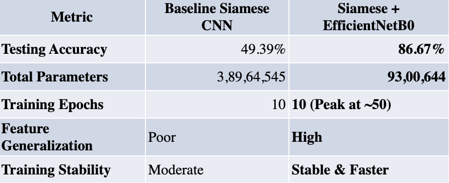

# Face Verification with Siamese Network & EfficientNetB0

## Project Description

This project provides an face verification system using a Siamese Neural Network as the backbone, enhanced with a pre-trained EfficientNetB0 feature extractor. It is designed to compare pairs of facial images and determine if they belong to the same person, making it suitable for authentication and security applications. The model achieves high accuracy while remaining lightweight, making it ideal for deployment on edge devices. The repository includes all necessary code, instructions, and a sample data structure to help you get started quickly.

### This repository contains:

1. Model Architecture: Siamese Neural Network with EfficientNetB0 as the feature extractor.
2. Data Structure: Example folder structure for organizing anchor, positive, and negative images.
3. Requirements: requirements.txt file listing all Python dependencies.
4. Documentation: Step-by-step instructions for installation, usage, and customization.
5. Sample Results: Example outputs and accuracy metrics.
6. License: Open-source license for academic and commercial use.


## Table of Contents
- [Background](#Background)
    - [Context and Motivation](#context-and-motivation)
    - [Objectives](#objectives)
    - [Significance of the Study](#significance-of-the-study)
- [Data Preparation](#Data-Preparation)
    - [Dataset Collection and Structuring](#Dataset-Collection-and-Structuring)
    - [How the Dataset is Created](#How-the-Dataset-is-Created)
    - [Pair Types in Training](#Pair-Types-in-Training)
- [Model Architecture and Components](#Model-Architecture-and-Components)
    - [Embedding Layers and Feature Extraction](#Embedding-Layers-and-Feature-Extraction)
    - [L1 Distance and Similarity Score Computation](#L1-Distance-and-Similarity-Score-Computation)
    - [Siamese-Blocks](#Siamese-Blocks)
    - [EfficientNetB0](#EfficientNetB0)
    - [Integration and Training Process](#Integration-and-Training-Process)
    - [Face Verification Mechanics](#Face-Verification-Mechanics)
- [Installation](#Installation)
    - [Prerequisites](#Prerequisites)
    - [Steps](#Steps)
        - [Clone the repository](#Clone-the-repository)
        - [(Optional)Create and activate a virtual environment](#(Optional)Create-and-activate-a-virtual-environment)
        - [Install dependencies](#Install-dependencies)
- [Results and Evaluation](#Results-and-Evaluation)
- [Project Structure](#Project-Structure)
- [Documentation](#documentation)
- [Future Work](#Future-Work)
- [References](#references)
- [License](#license)

## Background
This project implements a **Siamese Neural Network** with **EfficientNetB0** backbone for face verification tasks. It compares pairs of facial images to determine if they belong to the same person, achieving **87% accuracy** while being optimized for edge devices.


### Context and Motivation

In the evolving landscape of biometric authentication, face recognition and verification have become foundational components in systems ranging from smartphone security and smart surveillance to border control and digital identity verification. As these systems increasingly operate in diverse and unconstrained environments, they demand high precision, robustness, and adaptability to real-world conditions. Traditional face recognition approaches, reliant on handcrafted features or shallow classifiers, often fail to cope with variations in lighting, pose, expression, and occlusions.

To address these challenges, deep learning has emerged as a powerful tool, capable of learning hierarchical representations directly from raw facial data. In particular, Siamese Neural Networks (SNNs) have shown promise in face verification tasks due to their ability to learn meaningful similarity metrics from limited labeled data. However, the effectiveness of such models heavily depends on the quality of feature extraction and the architectural design used in learning embeddings.


### Objectives

This research aims to design and evaluate a face verification system based on a Siamese neural network integrated with EfficientNetB0. The key objectives are:

	Architecture Design: Develop a Siamese network that compares image pairs and learns a discriminative embedding space using contrastive learning and L1 distance for facial similarity measurement.

	Backbone Optimization: Employ EfficientNetB0 as the feature extraction backbone to leverage pre-trained knowledge and improve convergence, while maintaining a manageable number of parameters for efficient training and inference.

	Performance Comparison: Evaluate and compare the baseline Siamese network (using a custom CNN) with the EfficientNet-enhanced version across metrics such as testing accuracy, model size, and training efficiency.

	Practical Deployment: Demonstrate the model’s potential for real-world applications such as secure access systems, user authentication, and surveillance, while maintaining generalization across unseen faces.


### Significance of the Study

This work contributes to the growing body of research on face verification by offering a lightweight yet accurate solution suitable for practical deployment. The key contributions include:

	Improved Verification Accuracy: Demonstrating that EfficientNetB0 significantly enhances the model’s ability to distinguish between similar and dissimilar faces.
	
	Model Efficiency: Achieving high accuracy with fewer parameters compared to traditional CNNs, making the model suitable for edge computing and real-time applications.

	Foundations for Future Work: Establishing a strong baseline for future enhancements such as the integration of ArcFace loss, which can further refine feature separation through angular margin penalties.

By addressing the intersection of deep metric learning, efficient architectures, and real-world deployment constraints, this study aims to advance the development of reliable and scalable face verification systems.


## Data Preparation

### Dataset Collection and Structuring

The dataset for this project is organized into three categories: **anchor**, **positive**, and **negative** images. This structure supports metric learning techniques such as contrastive learning and triplet loss.

- **Anchor Images:**  
  Reference images for each individual. Each anchor serves as a baseline for comparison (e.g., a frontal face image of a person).

- **Positive Images (Same-Person Pairs):**  
  Images of the same individual as the anchor, possibly with variations in lighting, facial expression, or pose. These help the model learn facial similarity.

- **Negative Images (Different-Person Pairs):**  
  Images of different individuals than the anchor. These help the model learn to distinguish between different identities.


<p align="center">
  
</p>

### How the Dataset is Created

- **Data Collection:**  
  Images are sourced from publicly available facial recognition datasets. Each identity has multiple images, enabling the creation of anchor-positive and anchor-negative pairs.

- **Folder Structure:**  

```
    data/
├── anchor/ # Reference images (e.g., one image per person)
├── positive/ # Additional images of the same individuals (matching the anchor)
└── negative/ # Images of different people (non-matching pairs)
```


- **Preprocessing Steps:**  
- **Face Detection:** Faces are detected using OpenCV’s Haar Cascade classifier.
- **Resizing:** All images are resized to 100x100 pixels.
- **Normalization:** Pixel values are scaled between 0 and 1.
- **Augmentation:**  
  - For positive pairs: Minor variations (rotation, brightness, etc.) are applied to simulate real-world conditions.
  - For negative pairs: No augmentation is applied, as they already provide contrast.

### Pair Types in Training

| Pair Type      | Description                                 | Purpose in Training         |
|----------------|---------------------------------------------|----------------------------|
| Positive Pair  | Anchor & another image of the same person   | Helps model learn similarity|
| Negative Pair  | Anchor & an image of a different person     | Helps model learn dissimilarity|


<p align="center">
  
</p>


<p align="center">
  
</p>

This data preparation strategy ensures the model learns both to recognize the same person under different conditions and to distinguish between different individuals.


## Model Architecture and Components

The core of this face verification system is a **Siamese Neural Network** designed to learn a similarity function between pairs of facial images. The model processes two inputs simultaneously—typically an anchor image and a positive or negative sample—and predicts whether they represent the same individual. To enhance feature extraction, **EfficientNetB0** is integrated as the embedding backbone for both branches of the network.

### Embedding Layers and Feature Extraction

- **Baseline Model:**  
  A custom CNN with four convolutional layers (filters: 64, 128, 128, 256), MaxPooling layers, and a fully connected dense layer (4096 units, sigmoid activation) transforms input images into high-dimensional embeddings.

- **Improved Model:**  
  The custom CNN is replaced with **EfficientNetB0**, a pre-trained lightweight architecture that uses compound scaling to balance depth, width, and resolution. EfficientNetB0 is applied identically to both input branches (weight-sharing), and its output embeddings form the basis for similarity computation.

### L1 Distance and Similarity Score Computation

After embeddings are generated from both input images, a custom **L1 Distance** layer computes the absolute difference between the two feature vectors:

```
L1 Distance = |EmbeddingA − EmbeddingB|
```

This distance vector is then passed through a Dense layer with sigmoid activation, outputting a single probability score indicating whether the two faces match (1) or not (0).

### Siamese Blocks

- Both input branches share identical parameters, ensuring consistent feature extraction and effective metric learning.
- The shared weights between the two EfficientNetB0 branches enforce that both inputs are processed in the same manner, which is crucial for fair and consistent similarity evaluation.

<p align="center">
  
</p>

### EfficientNetB0

**EfficientNetB0** is a lightweight and high-performing convolutional neural network known for its use of compound scaling. Pre-trained on ImageNet, it offers rich feature extraction capabilities with significantly fewer parameters than traditional CNNs.

<p align="center">
  
</p>

**Benefits in this project:**
- **Transfer Learning:** Leveraging pre-trained weights enables faster convergence and better generalization.
- **Efficiency:** Drastically reduces the number of trainable parameters while maintaining high accuracy.
- **Robust Features:** Hierarchical feature maps improve the model’s ability to capture subtle differences and similarities between facial images.

The two input images (anchor and candidate) are passed through identical EfficientNetB0 pipelines, which output compact embedding vectors. These embeddings are then compared via an L1 distance layer and passed to a dense layer for binary classification (match/no match).

### Integration and Training Process

<p align="center">
  
</p>

- **Loss Function:** Binary Cross-Entropy (BCE) Loss is used for the binary classification task.

- **Optimizer:** Adam optimizer with a learning rate of 0.0001.

- **Training Strategy:**  
  - The model is trained on batches of positive and negative pairs.
  - In the EfficientNetB0 variant, base layers are initially frozen to preserve pre-trained weights and later optionally fine-tuned.

- **Early Stopping and Regularization:** Employed to prevent overfitting and ensure stable convergence.

### Face Verification Mechanics

- For each input pair, embeddings are generated via EfficientNetB0.
- Embeddings are compared using the L1 distance.
- The similarity score is interpreted as a binary decision output (Match/No Match), enabling the model to generalize well to unseen identities and perform accurate verification in real-world, unconstrained settings.


## Installation

### Prerequisites

- **Python 3.8+**: [Download Python](https://www.python.org/downloads/)
- **pip**: Comes with Python, but ensure it's up to date (`python -m pip install --upgrade pip`)
- **Git**: For cloning the repository ([Download Git](https://git-scm.com/downloads))
- **TensorFlow 2.6+**: For deep learning (installed via `requirements.txt`)
- **OpenCV 4.5+**: For image processing (installed via `requirements.txt`)
- **NumPy 1.19+**: For numerical operations (installed via `requirements.txt`)
- **Matplotlib**: For plotting and visualization (installed via `requirements.txt`)

### Steps

1. **Clone the repository:**
   ```bash
   git clone https://github.com/ganesh2427/recognition_rawmodel.git
   cd recognition_rawmodel
   ```

2. **(Optional) Create and activate a virtual environment:**
   ```bash
   python3 -m venv venv
   source venv/bin/activate  # On Windows use: venv\Scripts\activate
   ```

3. **Install dependencies:**
   ```bash
   pip install -r requirements.txt
   ```

---

Now you are ready to use the project!


## Results and Evaluation

The performance of the face verification system was assessed through a comparative analysis between two model configurations:
1. **Baseline Siamese Network** with a custom CNN backbone
2. **Enhanced Siamese Network** integrating EfficientNetB0 as the feature extractor

### Evaluation Criteria

- **Testing Accuracy**
- **Number of Trainable Parameters**
- **Training Efficiency** (Epochs to Converge)
- **Qualitative Feature Learning** (Generalization on Unseen Data)

### Siamese Network with Custom CNN (Baseline)

- The model began with a very low loss (0.015), but the positive pair accuracy (p.result()) rapidly declined from 99.3% to around 49%.
- This indicates that although the network was minimizing the loss, it struggled to generalize to new face pairs.

<p align="center">
  
</p>

### Siamese Network with EfficientNetB0

- The model started with a higher initial loss (~0.67), but both the loss and positive accuracy improved steadily over time.
- The model reached a positive accuracy of over 93% with a lower final loss than it started with.
- This reflects better generalization, stability, and learning capability, confirming the effectiveness of EfficientNetB0 for face feature extraction.

<p align="center">
  
</p>


### Performance Comparison (On Test Data)

<p align="center">
  
</p>

### Key Observations

- The integration of EfficientNetB0 resulted in a dramatic increase in accuracy (from ~49% to ~87%), indicating a significantly better understanding of facial similarity.
- Despite having fewer parameters (less than one-fourth of the baseline model), the EfficientNet-enhanced version outperformed the larger custom CNN. This demonstrates the power of transfer learning and compound-scaled architectures.
- Training was more stable with EfficientNetB0, achieving strong results with minimal overfitting and more consistent convergence.
- The feature embeddings produced by EfficientNet were more discriminative, enabling the model to separate positive and negative pairs more effectively even under varying lighting and expressions.


## Project Structure

The repository is organized as follows:


```.
├── README.md
├── backend
│ ├── face.py
│ ├── haarcascade_frontalface_default.xml
│ ├── raw_siamese.ipynb
│ ├── results
│ │ ├── Screenshot 2025-04-09 at 10.31.59 PM.png
│ │ ├── Screenshot 2025-04-10 at 7.25.33 PM.png
│ │ └── Screenshot 2025-04-10 at 7.25.40 PM.png
│ ├── siamese efficient.ipynb
│ ├── siamese.ipynb
│ ├── siamesemodelv2.keras
│ └── siamesemodelv3.keras
├── requirements.txt
└── research_papers
├── 1-s2.0-S2665917423001368-main.pdf
├── 2312.14001v2.pdf
├── A_Review_of_Face_Recognition_Technology.pdf
└── siamese neural network.pdf
```


## Documentation

- 📄 [Project Report (PDF)](project_docs/Face_Verification_Report.pdf)
- 🖼️ [Poster (PNG)](project_docs/Face_Verification_Poster.png)


## Future Work

- **Integration of ArcFace Loss:** Incorporate angular margin-based ArcFace loss to further improve the discriminative power of facial embeddings.
- **Hard Negative Mining:** Implement strategies to select challenging negative pairs during training, enhancing model robustness.
- **3D Face Data:** Extend the system to utilize 3D facial datasets for improved performance under varying poses, lighting, and occlusions.
- **Model Optimization for Edge Devices:** Apply techniques such as quantization, pruning, and knowledge distillation to reduce model size and inference time for deployment on mobile and embedded devices.


## References

- [A Review of Face Recognition Technology](research_papers/A_Review_of_Face_Recognition_Technology.pdf)
- [Siamese Neural Network Paper](research_papers/siamese%20neural%20network.pdf)
- [Paper: 1-s2.0-S2665917423001368-main](research_papers/1-s2.0-S2665917423001368-main.pdf)
- [Paper: 2312.14001v2](research_papers/2312.14001v2.pdf)


## License

This project is licensed under the MIT License.  
See the [LICENSE](LICENSE) file for details.
 

 

